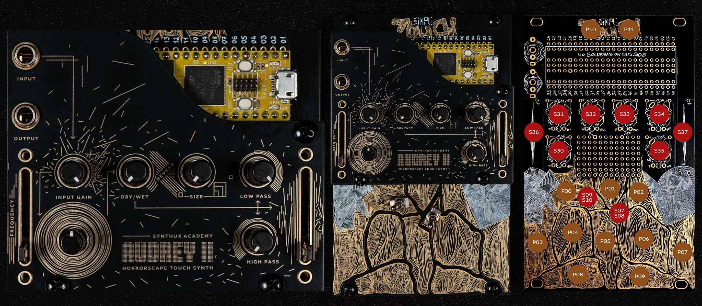

# 🪴 Audrey II Touch
Audrey II is a horrorscape synthesizer used by film composers, sound designers and composers. 

## 🪴 Audrey II Touch Faceplate
**Order the faceplate only:**  
[➡️ Audrey II Touch Faceplate](https://synthux.myshopify.com/products/audrey-ii-touch-faceplate-only?utm_source=copyToPasteBoard&utm_medium=product-links&utm_content=web)

**Or get the full Simple Touch package**, including all faceplates — *Audrey, Bass, String, FX, and Blank*:  
[🎛️ Order Simple Touch](https://www.synthux.academy/simple-synth/touch2)

## QUICK INSTALL
Download the [Binary file](https://github.com/Synthux-Academy/AudreyTouch/releases/latest/download/AudreyTouch.bin) and flash using the [Daisy Seed web programmer](https://flash.daisy.audio/)

## Manual

Audrey Touch uses the same core concept as the larger Audrey II; the main driving factor is the feedback loop, with controls to manipulate that flow. (The delay section of Audrey II is not implemented.) Whereas Audrey II firmware does have audio input, the standard build does not include that hardware, although it can be modded by simply adding the input jack.

The idea is to excite the loop in varying amounts to create drifting horrorscapes. By inputting audio, you can also use that audio as a driving force, which allows Audrey Touch to function as an effect for any audio source. Try using anything from percussive drum loops to melodies to voice.

Have a look at the flow chart embedded into the faceplate design to understand how parts interact.



### Controls

> Note: always be careful with volume levels.
> The controls offer a wide range of possibilities, and fine-tuning and experimentation are key to finding sweet spots. Different inputs will produce different results, so it is always a good idea to start with the minimum pot positions (CCW) and slowly bring up S30, the excitation amount, and S31, the input gain.

**Audio In**: Only the left channel is used from the stereo line input.
**Audio Out**: stereo line out

#### Knobs:

- S30 - Main control, use this to set a trigger threshold
- S31 - Input gain, turn down to disable and only use internal exciter
- S32 - Dry / Wet, how much does the sound desintegrate
- S33 - Size, space out the reverb
- S34 - Low Pass, use in conjunction with high pass to narrow down the range
- S35 - High Pass
- S37 (right fader) - filter mix
- S36 (left fader) - frequency

#### Pads

**Frequency:**

- P03 - P09 - tap to excite different frequencies
- P00 - tap for octave down
- P02 - tap for octave up

**Drone**: 

- P11 + P02 - Hold P11 and tap P02 to toggle drone 

**Envelope**: 

- P11 + S37 - Hold P11 and move the right fader to change the envelope (same envelope as Touch Bass)

#### Switches:

- The left switch changes scales of the pads. 
- The right switch controls modulation over the right fader. Keep it down for no modulation, center for sine and up for S&H with slew. 

---
## MIDI Implementation

Receives on all channels, understands NoteOn/Off and CCs:

- 7 - Output volume
- 12 - Reverb decay
- 70 - Frequency
- 74 - LP filter cutoff
- 75 - Feedback gain
- 76 - Feedback body
- 77 - Input volume
- 81 - HP filter cutoff
- 91 - Reverb mix

## Installing Audrey II Firmware on Simple Touch
- Download the [latest .bin file](https://github.com/Synthux-Academy/AudreyTouch/releases/latest/download/AudreyTouch.bin) from the [repository releases section.](https://github.com/Synthux-Academy/AudreyTouch/releases/) 
- Hold down BOOT and then press RESET, then release both buttons. This will put the Daisy into BOOT MODE (you can tell you did it right if the top LED stops flashing).
- Upload the firmware via the [web flash tool](https://flash.daisy.audio/).
- Or build the firmware yourself using the instructions below

## Building the Audrey Touch firmware

### 1. Setup
- Follow the [Daisy Developer Setup Guide](https://daisy.audio/tutorials/cpp-dev-env/#follow-along-with-the-video-guide) to install the required toolchain (ARM GCC, Make, etc.).
- Clone this repository
- Install the submodules via

```bash
git submodule update --init --recursive
cd lib/DaisySP/
make
cd ../libDaisy/
make
```

### 2. Build

```bash
make clean ; make;
```
The resulting .bin file will appear in the build/ directory.
### 3. Flash
- To flash directly from your computer (via USB DFU mode):
```bash
make program-dfu
```
- OR use the [web flash tool](https://flash.daisy.audio/)
