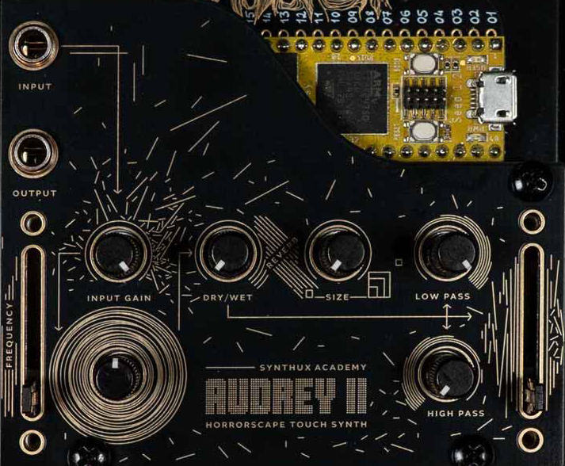

# AudreyTouch Manual

This manual goes deeper than the [README](README.md) — background on the instrument, how it differs from its bigger sibling, a full controls/MIDI reference, and a step-by-step workflow to get lost in the feedback loop. See the README for ordering the faceplate, quick install, and build instructions.

## Quick Reference: Controls & MIDI CC Map

Every knob and fader has a matching CC, but a few CCs reach further than any single physical control does — and a couple of pad combos aren't printed on the faceplate at all. So having a quick cheat sheet is helpful.

| Function | Physical control | CC | 1:1 with hardware? |
|---|---|---|---|
| Feedback gain (main / threshold) | S30 | **75** | Yes |
| Input volume | S31 | **77** | Yes, by default (see note below) |
| Reverb mix (dry/wet) | S32 | **91** | Yes |
| Reverb decay (size) | S33 | **12** | Yes, same response curve |
| LP filter cutoff | S34 | **74** | Yes, same logarithmic curve |
| HP filter cutoff | S35 | **81** | Yes, same logarithmic curve |
| Frequency | Pads P03–P09 + S36 (offset) + P00/P02 (octave) | **70** | No — CC70 sets pitch directly across the full range, bypassing the pad + fader + octave combination used on the hardware |
| Feedback body | S37 (right switch in its "off"/direct position) | **76** | Yes, in that switch position — see note below |
| Envelope shape | Hold **P11** + move S37 | **72** | No dedicated knob — only reachable by that hold-gesture on the hardware |
| Output volume | Hold **P10** + move S31 | **7** | No dedicated knob — undocumented pad combo, not printed on the faceplate |

Notes:
- **S31 is dual-purpose**: normally it's input gain (CC 77). Hold pad **P10** while moving it and it controls output volume (CC 7) instead. This combo exists in the firmware but isn't on the panel silkscreen.
- **S37 is also dual-purpose**, gated by the right switch and by holding P11. With the right switch in its "off"/no-modulation position and P11 not held, S37 sets feedback body (CC 76). Hold P11 instead, and it sets envelope shape (CC 72). With the right switch in either modulation position, S37 instead drives an internal LFO's rate and depth rather than body directly — that LFO has no CC of its own.
- Every CC above accepts a full 0–127 range mapped onto the same curve (linear, log, or exponential) as its physical counterpart, so a MIDI controller and the panel control feel the same.
- **No soft takeover between MIDI and the panel** — whichever one last sent a value wins, and it holds until the other side moves. A CC message will overwrite a knob's setting and stay there; but the instant you touch that knob again, it snaps the parameter back to the knob's physical position (not a smooth pickup). If you're automating a control over MIDI, expect a jump if you also touch its knob.

## What Is Audrey Touch?

### Origins

Audrey was originally conceived by **Nick Donaldson** of Infrasonic Audio. **Roey**, founder of Synthux Academy and designer of the Simple Designer platform and Simple Touch PCBs, designed the faceplates and ported the concept to this hardware. See [CREDITS.md](CREDITS.md) for the full list — Nick Donaldson for the original Audrey engine, Alberto Berera and Rosa Schuurmans for the Simple Touch port and instrument-behavior revisions, and Vlad Litvinenko for USB MIDI.

The original Audrey II design and background is documented at the [Synthux Academy simple-designer-instruments repo](https://github.com/Synthux-Academy/simple-designer-instruments/tree/main/official/audrey-ii).

### How Audrey II Works

At the core of Audrey II is a Karplus-Strong string model — one of the simplest possible string/waveguide physical-modeling implementations. Rather than the noise-burst excitation typical of "realistic" K-S models, Audrey II feeds the string a constant stream of inaudible white noise, so no sound is produced until the outer feedback gain is increased. That's what activates the feedback loop and lets a signal build: the K-S delay line length ("frequency") sets the rough fundamental pitch, and the rest of the loop's controls shape which overtones resonate and the overall timbre.

The signal flow on the full-size Audrey II:

1. **Karplus-Strong synthesis & distortion** — string synthesis creates resonant, droning tones; feedback and soft-clipping distortion add raw, aggressive edges.
2. **Reverb** — a rich, spacious reverb lets the drone and feedback bloom into haunting, immersive atmospheres.
3. **Filters** — high-pass and low-pass filters plus a body control shape the sound further, revealing overtones and harmonic textures.
4. **Tape delay emulation** — a long tape-style delay further degrades and expands the sound, with a feedback control designed to deliberately produce infinitely growing, saturating feedback.
5. **Stereo output** — the stereo feedback path widens the soundstage into rich, layered textures.

Watch: [Introducing Audrey II](https://www.youtube.com/watch?v=HaxZd4dc9cU), and [an interview with Nick Donaldson](https://www.youtube.com/watch?v=R0vv96X58bQ) on his journey designing it.

### How Audrey Touch Differs from Audrey II

AudreyTouch keeps the same core idea — the feedback loop is the main driving force, with controls to manipulate that flow — but adapts it to the Simple Touch platform:

- **The tape delay / "body" delay section of Audrey II is not implemented** on Touch. (The firmware reserves parameter slots for an echo delay, but it isn't wired up to any control yet.)
- **Only the left channel of the audio input is used.** Simple Touch's stereo line input and output are standard hardware — no modding required — but the AudreyTouch firmware only reads the left channel.
- **Pads replace keys/CV** as the excitation source, alongside an internal exciter (feedback loop) that can also be driven by that external audio input — turning AudreyTouch into a feedback-based effect for drum loops, melodies, or voice.

## Physical Layout

Refer to the flow chart embedded in the faceplate design (above) to see how the sections connect. For a closer look at the panel labels (S30–S37, P00–P11):

**Audio In**: stereo line input; only the left channel is used.
**Audio Out**: stereo line out.

> **Careful with volume levels.** The controls offer a wide range of possibilities, and fine-tuning and experimentation are key to finding sweet spots. Different inputs produce different results, so it's always a good idea to start with pots fully counter-clockwise (CCW) and slowly bring up S30 (excitation amount) and S31 (input gain).

## Controls in Detail

### Knobs & Faders

| Control | Function |
|---|---|
| S30 | Main control — sets the feedback trigger threshold/gain |
| S31 | Input gain — turn down to disable and use only the internal exciter (hold P10 to instead control output volume) |
| S32 | Dry/Wet — how much the sound disintegrates |
| S33 | Size — spaces out the reverb |
| S34 | Low Pass — use with High Pass to narrow the frequency range |
| S35 | High Pass |
| S36 (left fader) | Frequency offset |
| S37 (right fader) | Filter/body mix (hold P11 to instead control envelope shape) |

### Pads

**Frequency:**
- P03–P09 — tap to excite different frequencies
- P00 — tap for octave down
- P02 — tap for octave up

> **Playing exact pitches over MIDI?** NoteOn messages aren't immune to the panel: the incoming note is added to whatever S36 and the octave pads currently hold, and that offset persists silently until something changes it back. Both start at zero on boot, so if you never touch S36 or tap P00/P02 outside their P11-hold combos, notes play at their exact value (clamped to 16–88). For pitch that's always exact regardless of panel state, send **CC70** instead of NoteOn — it sets frequency directly and skips this combination logic entirely.

**Scale** (undocumented on the faceplate, confirmed in firmware):
- Hold **P11** and tap **P00** to cycle through the three pad scales.
- These are custom interval sets rather than standard named Western scales — semitone offsets from the root, applied across pads P03–P09:

  | Scale | Offsets (semitones from root) | Character |
  |---|---|---|
  | 1 (default) | 0, 2, 4, 5, 9, 12, 14 | brighter, more spread out |
  | 2 | 0, 5, 6, 9, 10, 12, 13 | clustered minor-second intervals — dissonant, eerie |
  | 3 | 0, 2, 3, 7, 9, 12, 14 | darker, pentatonic-like |

  The root is MIDI note 16 (~20Hz — felt more than heard), shifted by the P00/P02 octave pads and offset further by S36 (up to +24 semitones).

**Drone:**
- Hold **P11** and tap **P02** to toggle drone mode.

**Envelope:**
- Hold **P11** and move the right fader (S37) to change the envelope shape (same envelope as Touch Bass).

**Output volume** (undocumented on the faceplate, confirmed in firmware):
- Hold **P10** and turn S31 to control output volume instead of input gain.

### Switches

- **Left switch** — **Unused / free** Ideas are welcome.
Intended to change pad scales; in the current firmware this isn't wired up. Use the P11 + P00 pad combo above to cycle scales instead.
- **Right switch** — controls modulation over the right fader (S37): down is no modulation (direct body control); the other two positions both drive a randomized sample-and-hold-style modulator (not a literal sine wave, despite older docs) at different rates — roughly 1–8Hz and 0.01–0.51Hz. See [Under the Hood](#under-the-hood-controls--the-signal-path) for how this works.

## Getting Started: A Workflow Example

### 1. Reset to a known state
1. Power off. Set all knobs and faders to zero/CCW, left switch to the left, right switch to the bottom.
2. Power on and set your external volume to a safe level — Audrey can get loud suddenly.
3. Touching a pad can still produce sound immediately after boot, even with every control at zero. This is expected: output volume defaults to a moderate level regardless of any knob, and the string is always resonating a faint constant noise floor, so there's a little sound to reveal as soon as a pad changes its pitch.
4. Without touching any pads, wiggle each knob back through zero once to make sure the firmware has registered its position. This matters because on boot the firmware doesn't yet know where a knob physically sits, so a knob left slightly off zero from a previous session can snap to its real value the instant it's read — wiggling it forces that sync while it's still at zero.

### 2. Excite the loop
With everything still at zero/CCW and both faders down:
1. Set S30 slightly past halfway.
2. Set the right fader (S37) to its top position — it's inverted, so top gives the *shortest* feedback body delay, the cleanest and most predictable starting point.
3. While touching a pad, slowly open S34 (Low Pass) — about a third to halfway to start.
4. Once you hear sound, play with the right fader and the filter knobs, and try the left fader (S36) and different pads to explore frequencies.

This should give you a controllable sound that stops as soon as you release the pad.

### 3. Add reverb
1. Open S32 (Dry/Wet) about halfway so the S33 (Size/reverb) can come into play.
2. Slowly increase S33 and notice the reverb feeding back into the loop.

### 4. Latch / hold a drone
1. Hold P11 and tap P02 to trigger latch/hold (drone) mode — the loop keeps ringing without holding a pad down.

### 5. Bring in an external input
Plug a source into the left channel of the stereo line input:
1. Start with S31 (input gain) low and slowly bring it up.
2. Keep an eye on dry/wet, reverb, and filter settings as you do.
3. Different sources (percussion, voice, melodic loops) will need different settings — experimentation is key.

## Under the Hood: Controls & the Signal Path

The five-stage signal flow described in [How Audrey II Works](#how-audrey-ii-works) is implemented in `Source/FeedbackSynthEngine.cpp`. Every control reaches it through a thin parameter layer in `Source/FeedbackSynthControls.cpp`, which is where a knob movement or an incoming CC both end up calling the same setter — see `Controls::registerParams()` ([FeedbackSynthControls.cpp:226-273](Source/FeedbackSynthControls.cpp#L226-L273)) for the full wiring in one place. Here's how each stage maps to code, for anyone who wants to dig further or change something.

### 1. Excitation & Karplus-Strong string
- The constant white-noise exciter is not a control — it's fixed at a very low level (`noise_.SetAmp(dbfs2lin(-90.0f))`, [FeedbackSynthEngine.cpp:31](Source/FeedbackSynthEngine.cpp#L31)) and keeps the string moving at all times. This is what the outer feedback gain "wakes up."
- **Frequency** (pads / S36 / CC70) — `Controls::applyFrequency()` ([FeedbackSynthControls.cpp:216-224](Source/FeedbackSynthControls.cpp#L216-L224)) combines pad note + S36 offset + octave shift, clamps to 16–88, then `Engine::SetStringPitch()` ([FeedbackSynthEngine.cpp:64-68](Source/FeedbackSynthEngine.cpp#L64-L68)) converts it to Hz via `mtof()` and sets both string channels.
- **Feedback gain** (S30 / CC75) — `Engine::SetFeedbackGain()` ([FeedbackSynthEngine.cpp:70-72](Source/FeedbackSynthEngine.cpp#L70-L72)) converts dB to a linear multiplier. It's only applied when writing the processed signal back into the delay line ([FeedbackSynthEngine.cpp:213-214](Source/FeedbackSynthEngine.cpp#L213-L214)) — not to the direct output — which is why it behaves like a regeneration/threshold control rather than a volume knob.

### 2. Distortion
- Two `Overdrive` instances sit right after the string in `Process()` ([FeedbackSynthEngine.cpp:194-195](Source/FeedbackSynthEngine.cpp#L194-L195)), with a fixed drive amount (`0.4`, set once at init, [FeedbackSynthEngine.cpp:48](Source/FeedbackSynthEngine.cpp#L48)). Always on — not exposed to any knob or CC.

### 3. Filters & body
- **Low Pass / High Pass** (S34+S35 / CC74+CC81) — `SetFeedbackLPFCutoff()` / `SetFeedbackHPFCutoff()` ([FeedbackSynthEngine.cpp:80-86](Source/FeedbackSynthEngine.cpp#L80-L86)), both mapped logarithmically (`Mapping::LOG`, [FeedbackSynthControls.cpp:242-245](Source/FeedbackSynthControls.cpp#L242-L245)), applied to the loop signal right after distortion ([FeedbackSynthEngine.cpp:198-199](Source/FeedbackSynthEngine.cpp#L198-L199)).
- **Feedback body** (S37 direct mode / CC76) — `Engine::SetFeedbackDelay()` ([FeedbackSynthEngine.cpp:74-78](Source/FeedbackSynthEngine.cpp#L74-L78)) sets the target length of a second delay line inside the loop, smoothed every block ([FeedbackSynthEngine.cpp:162](Source/FeedbackSynthEngine.cpp#L162)) — this is the "body" resonator from the Audrey II signal flow. Note S37's raw fader value is inverted before being applied ([FeedbackSynthControls.cpp:184-185](Source/FeedbackSynthControls.cpp#L184-L185)), so top = shortest body delay (see the workflow note above).

### 4. Reverb
- **Reverb mix** (S32 / CC91) — `SetReverbMix()` ([FeedbackSynthEngine.cpp:102-105](Source/FeedbackSynthEngine.cpp#L102-L105)) crossfades the loop signal against the `ReverbSc` output ([FeedbackSynthEngine.cpp:207-208](Source/FeedbackSynthEngine.cpp#L207-L208)).
- **Reverb decay / "Size"** (S33 / CC12) — `SetReverbFeedback()` ([FeedbackSynthEngine.cpp:107-110](Source/FeedbackSynthEngine.cpp#L107-L110)) sets the reverb algorithm's internal feedback coefficient directly — its "size" is really tail length via feedback amount, not a room-size parameter.

### 5. Loop feedback & envelope
- **Envelope shape** (hold P11+S37 / CC72) — `Engine::SetShape()` ([FeedbackSynthEngine.cpp:137-140](Source/FeedbackSynthEngine.cpp#L137-L140)) reshapes the ASR envelope curve (`Source/env.h`). The resulting envelope value gates how much signal gets written back into the loop on every NoteOn/NoteOff ([FeedbackSynthEngine.cpp:213-214](Source/FeedbackSynthEngine.cpp#L213-L214)) — it never touches the direct output.
- **Drone** (hold P11+P02) — `Engine::DroneMode()` ([FeedbackSynthEngine.cpp:132-135](Source/FeedbackSynthEngine.cpp#L132-L135)) replaces that envelope gate with a constant `1.0` (`drone ? 1.0f : env`, [FeedbackSynthEngine.cpp:213](Source/FeedbackSynthEngine.cpp#L213)), so the loop keeps regenerating at full gain regardless of pad state.
- **Right-switch modulation** (drives S37's target instead of body directly) — `SetBodyLFOOn()` / `SetLFOFrequency()` / `SetLFODistribution()` ([FeedbackSynthEngine.cpp:142-157](Source/FeedbackSynthEngine.cpp#L142-L157)) and the LFO block in `Process()` ([FeedbackSynthEngine.cpp:164-174](Source/FeedbackSynthEngine.cpp#L164-L174)). Worth knowing: this isn't a literal sine oscillator despite the panel description — the internal `lfo_` object is a ramp wave used purely as a clock; on each half-cycle it picks a new random target value and slews toward it. Both modulation switch positions use that same randomized sample-and-hold-style mechanism, just at different rate ranges (fast ≈ 1–8Hz, slow ≈ 0.01–0.51Hz) — there's no distinct sine mode in the current firmware.
- **Output volume** (hold P10+S31 / CC7) and **input volume** (S31 / CC77) — `SetOutputLevel()` / `SetInputLevel()` ([FeedbackSynthEngine.cpp:112-120](Source/FeedbackSynthEngine.cpp#L112-L120)), applied at the very start (input, [FeedbackSynthEngine.cpp:185-187](Source/FeedbackSynthEngine.cpp#L185-L187)) and very end (output, [FeedbackSynthEngine.cpp:225-226](Source/FeedbackSynthEngine.cpp#L225-L226)) of `Process()` — output level is the one control that sits entirely outside the loop's feedback path; it just scales what leaves the box.

## Videos

- [Introducing Audrey II](https://www.youtube.com/watch?v=HaxZd4dc9cU)
- [Interview with Nick Donaldson of Infrasonic Audio](https://www.youtube.com/watch?v=R0vv96X58bQ)
- [Simple Touch Deep Dive by Roey](https://youtu.be/VV_USbp7pVw?t=1019) — jumps to the Audrey section
- [AudreyTouch demonstration by @baymud](https://youtu.be/l41w2Un2k3M) — getting lost in the world of feedback

## Credits

See [CREDITS.md](CREDITS.md).
